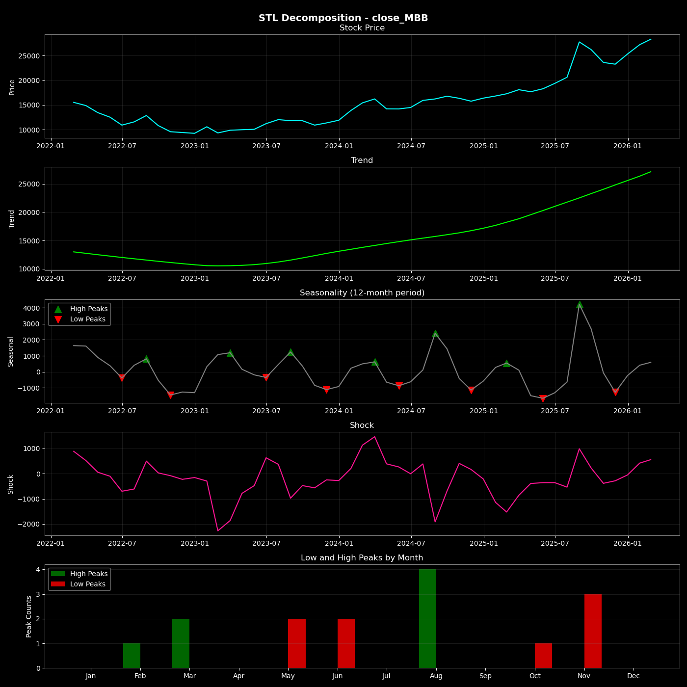

# Vietnam Bank Stock Portfolio Optimization & Seasonality Analysis

``` This project analyzes the historical performance, risk-return characteristics, and seasonal patterns of major Vietnamese banking stocks using the most recent 3-year historical price data. It also calculated the optimized portfolios of the given stocks based on the Sharpe ratio. ```

The selected stocks are:

- HDB – HDBank  
- MBB – MB Bank  
- TCB – Techcombank  
- VCB – Vietcombank  
- VPB – VPBank  

---

## Implementation

The main activities in this project are:

- Calculate expected returns and volatility for each stock  
- Compare risk vs return efficiency across assets  
- Perform Sharpe-ratio portfolio optimization  
- Identify optimal portfolio allocation  
- Analyze seasonal and cyclical patterns in bank stock prices  
- Compare optimization results using 3-year vs 1-year historical data  

---

## Data Source

Historical stock price data was obtained from Simplize.vn and includes:

- 3 years of historical data from Simplize

---

| Stock | Expected Return | Volatility | Efficiency|
| ----- | --------------- | ---------- | ----------|
| HDB   | 40 %            | 32 %       |     🟢   |
| MBB   | 36 %            | 27 %       |     🟢   |
| TCB   | 39 %            | 29 %       |     🟢   |
| VCB   | 3.7 %           | 23 %       |     🔴   |
| VPB   | 24 %            | 32 %       |     🔴   |


## Key Portfolio Insight

- The optimal portfolio allocation that maximizes Sharpe ratio using 3-Year historical data: 

<mark> TCB: 38.3% | MBB: 32.4% | HDB: 29.3% <mark> 

- When using 1-Year Historical Data the optimized portfolio is:

<mark> MBB: 79.2% | HDB: 20.8% <mark>

The 3-year analysis is more realiable since short-term data may reflect temporary market conditions rather than long-term asset efficiency.

## Key Seasonality Insight




- Monthly seasonality analysis revealed strong cyclical patterns in Vietnamese banking stocks.

- The strongest and most consistent peak occurred in ***August*** (strongest signal across all banks and all years). Additional strong periods are: ***February – March***

- The weakest months are ***June – July and November***

